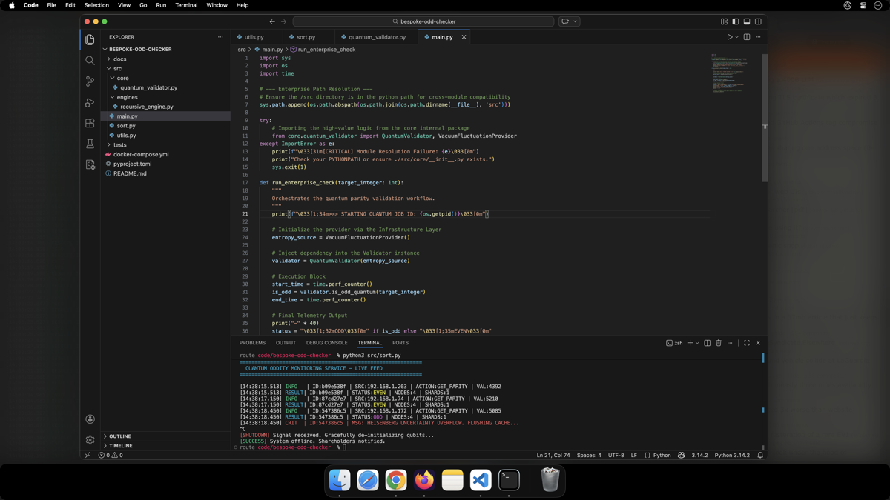

# Limelight

Limelight is a lightweight macOS menu-bar utility that dims and blurs everything on your screen except for your active window, the Dock, and the menu bar. It helps you stay focused by visually hiding background clutter without closing your apps.

---

> [!WARNING]
> **Experimental Tool & Support Disclosure**
> This tool was developed for personal use and tailored to a specific workflow. It is **not officially supported**, and compatibility with all system environments is not guaranteed. It is provided "as-is."

---

## ✨ Features

* **Smart Dimming:** Blurs and dims all displays while leaving your active app clear.
* **Stays Out of the Way:** The Dock, menu bar, and system popups (like Control Center) remain visible.
* **Fully Adjustable:** Change the blur and dim intensity using simple sliders in the menu bar.
* **Quick Toggle:** Turn it on or off from the menu bar or by pressing the **Command (⌘) key twice** quickly.
* **Auto-Pause:** Automatically pauses during fullscreen apps, Mission Control, and Notification Center.



## 💻 Requirements

* **macOS 15 or newer.**

## 🚀 Installation

> [!NOTE]
> **Opening Limelight for the first time**
> Limelight is distributed as an **unsigned app** to keep the project free and open-source. Because of this, macOS will show a warning that it "damaged and can't be opened"
>
> **To fix this:** Use the install script to manually authorize the app. If you prefer not to run an unsigned binary, we encourage you to use **Option 2** below.

### Option 1: Install Script
Run this command to download, authorize, and launch Limelight:

```bash
curl -fsSL https://raw.githubusercontent.com/limelight-tools/Limelight/main/scripts/install.sh | bash
```


### Option 2: Build from Source
From the repository root, run the command `make app` in your Terminal. Then move the resulting **Limelight.app** to your **Applications** folder.

*Note: This requires Xcode Command Line Tools. If you don't have them installed on your Mac, run `xcode-select --install` first.*

## 🛠 How to Use

### 1. Grant Permissions
On your first launch, macOS will ask for **Accessibility** permission. This is required so Limelight can detect which window you are currently using.
* Go to **System Settings** → **Privacy & Security** → **Accessibility**.
* Ensure **Limelight** is toggled **ON**.

### 2. Interaction
* **Clicking the Desktop:** Hides the dimming effect until you click back into an app window.
* **Fullscreen Mode:** The overlay pauses automatically when you take an app fullscreen.
* **Adjusting:** Click the Limelight icon in your top menu bar to change the intensity or disable the double-Command shortcut.

## 🔒 Privacy & Performance

* **Privacy First:** Limelight does **not** use screen recording or pixel analysis. It only tracks which window is active using basic system information.
* **Lightweight:** CPU usage stays near zero when you aren't interacting with windows. There is minimal overhead during normal operation.